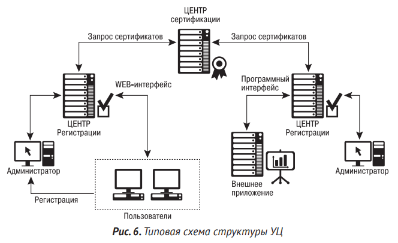

Цифровая личность — идентификационная информация, позволяющая однозначно определить человека в цифровом пространстве.[^1] 
Электронная подпись — информация в электронной форме, которая присоединена к другой информации в электронной форме (подписываемой информации) или иным образом связана с такой информацией, и которая используется для определения лица, подписывающего информацию. Основным законом, регулирующим вопросы, связанные с ней, является ФЗ РФ от 06.04.2011 № 63 «Об электронной подписи».[^2]
Электронная подпись использует систему с [асимметричным шифрованием](skzi.md). Наиболее распространенным способом организации управления сертификатами ключей является PKI (англ. Public Key Infrastracture — инфраструктура открытых ключей) — централизованная модель управления ключами, но существует и децентрализованная модель, которая используется, например, в PGP. Сертификат открытого ключа содержит такую информацию как открытый ключ владельца сертификата, срок действия сертификата, имя центра сертификации, имя владельца сертификата и цифровую подпись. Цифровая подпись создается как результат криптографической хэш-функции от данных сертификата, зашифрованного закрытым ключом центра сертификации.[^2] Сертификаты ЭП записываются на специальные токены или смарт-карты. Альтернативным решением является программно-аппаратные криптографические модули HSM (англ. Hardware security module — аппаратный модуль безопасности).
# виды эп
## простая
позволяет подтвердить факт ее формирования тем или иным лицом с использованием паролей или кодов.
## усиленная
позволяет кроме того определить факт внесения изменений в документ после его подписания, т.е. является средством проверки [целостности](cia-triad.md) документа.
### квалифицированная и неквалифицированная
открытый ключ квалифицированной электронной подписи находится в квалифицированном сертификате, который выдается аккредитованным удостоверяющим центром (УЦ).
	Если речь идет о десятках электронных подписей, которые должны быть юридически значимы по всей территории Российской Федерации, то имеет смысл раз в год покупать требуемое количество электронных подписей, заверенных сертификатом одного из крупных аккредитованных в Минкомсвязи РФ. Если количество электронных подписей, которые выдаются сотрудникам, измеряется сотнями, то имеет смысл организовать собственный УЦ.[^3]
# элементы системы электронного документооборота с использованием эп
1. удостоверяющий центр;
	1. центр сертификации отвечает за выпуск сертификатов ключей и за управление списком отозванных сертификатов;
	2. центр регистрации ответственен за ведение базы данных пользователей, списка сертификатов и т.д.;
	3. автоматизированное рабочее место (АРМ) пользователя, — как правило, веб-приложение, которое находится в центре регистрации и предназначено для регистрации пользователей, а также формирования ключей и запросов на сертификаты открытых ключей.
	4. АРМ администратора позволяет выполнять операции по регистрации пользователей, формировать закрытые ключи и запросы на сертификаты открытых ключей;
	5. АРМ разбора конфликтных ситуаций позволяет осуществлять операции по подтверждению подлинности ЭП и устанавливать статус сертификата открытого ключа.
2. крипто провайдер — программное обеспечение, которое выполняет криптографические операции и обеспечивающее функционал авторизации и обеспечения юридической значимости электронных документов при обмене ими между пользователями. [^4]

# источники
[^1]: Гродзенский Я. С. «Информационная безопасность : учебное пособие» – Москва : РГ-Пресс, 2020. стр. 49
[^2]: Гродзенский Я. С. … стр. 50
[^3]: Гродзенский Я. С. … стр. 51
[^4]: Гродзенский Я. С. … стр. 52-53