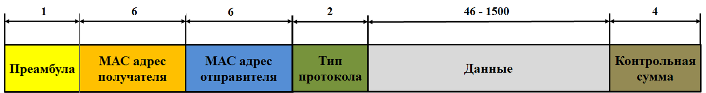

описывается стандартами группы IEEE 802.3: 
- Ethernet  10BASE-T со скоростью передачи данных 10Мбит/с по витой паре 3-й категории  и выше.
- Fast Ethernet 100BASE-T со скоростью передачи данных 100Мбит/с по витой паре 5-й категории.
- Gigabit Ethernet 1000BASE-T со скоростью передачи данных 1000Мбит/с по витой паре 5-й категории.
- 10 Gigabit Ethernet 10GBASE-T со скоростью передачи данных 10 Гбит/с по витой паре 6-й категории.

При поступлении пакета данных с сетевого уровня на канальный к пакету добавляется специальный заголовок. 
Существуют 4 типа кадра.
Структура кадра Ethernet II:

Преамбула - своего рода метка  начала кадра, чтобы сетевые устройства могли знать где заканчивается один кадр и начинается другой.
# источник
1. https://imvk.net/cisco/urok-12-tekhnologiya-ethernet