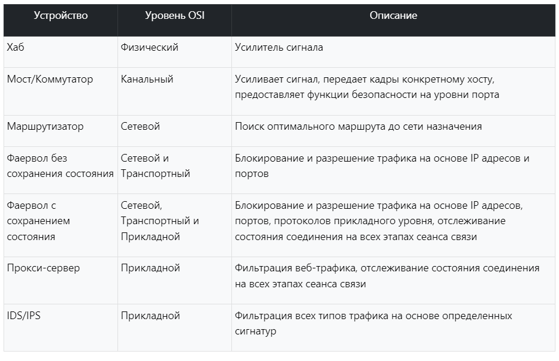

# Хаб (hub)
(half-duplex) 

работает на физическом уровне, служит только в качестве усилителя сигнала.
# Коммутатор (Switch)
(full-duplex)

работает на канальном уровне или на сетевом уровне, то есть в качестве маршрутизатора (L3 Switch). Помимо усиления сигнала коммутатор анализирует заголовок кадра и перенаправляет кадры определенным хостам на основе MAC-адреса. Кроме того, способен проверить поступивший кадр на наличие ошибок.
# Маршрутизатор (Router)

работает на сетевом уровне и оперирует IP адресами; способен перенаправлять пакеты через сотни сетевых устройств, находящиеся по всему миру.
Таблицу можно создать вручную - **статическая маршрутизация**.
	Плюсы  - позволяет снизить затраты процессора на вычисление таблицы, высокая скорость работы. Минусы - невозможно отслеживать состояние сети и оперативно на это реагировать, кроме того, это трудоемкий процесс в больших сетях.
Также таблицу можно создать автоматически с помощью специальных протоколов - **динамической маршрутизацией**.
	Маршрутизатор вычисляет оптимальный маршрут до узла назначения с помощью специальных алгоритмов. При этом данные алгоритмы учитывают расстояния до узла, состояние сети, скорость передачи канала связи, стоимость и другие параметры. Если топология сети изменится, то маршрутизаторы смогут определить это и вычислить новый маршрут. 
	Плюсы - автоматически определяется топология сети и вычисляется маршрут, экономит время, оперативно реагирует на изменения в сети. Минусы - значительно расходуются ресурсы процессора.

Функциональность:
- **Решения о маршрутизации**: анализируют входящие пакеты данных и принимают решения о том, по какому пути пересылать данные
- **Подключение сетей**: локальных и глобальной между собой
- **Управление трафиком**: управляют потоком данных для обеспечения оптимальной производительности и предотвращения перегрузки сети; определяют приоритетность определенных типов данных, таких как потоковое видео, для обеспечения лучшего взаимодействия с пользователем.
Типы:
- **Проводные**: Используют кабели Ethernet для подключения устройств к сети.
- **Беспроводные маршрутизаторы**: используют Wi-Fi для передачи данных между устройствами и являются наиболее распространенным типом маршрутизаторов.
- **Основные маршрутизаторы**: Работают в магистрали Интернета, направляя пакеты данных между основными сетями (такими как интернет-провайдеры). Эти маршрутизаторы представляют собой высокопроизводительные устройства, способные обрабатывать огромные объемы трафика данных.

Безопасность маршрутизатора:
- Изменение паролей и имен пользователей по умолчанию: важно установить надежный, уникальный пароль для вашего маршрутизатора.
- Регулярные обновления встроенного ПО: Поддерживайте актуальность ПО вашего маршрутизатора.
- Отключить удаленное управление, если вам она не нужна.   
- Создайте гостевую сеть: Это изолирует гостей от вашей основной сети, гарантируя, что они не смогут получить доступ к вашим устройствам или данным.
# другие
[Прокси-сервер](proxy.md) - используется для фильтрации веб-трафика.
[Фаерволл и Брандмауэр](firewall.md) - сетевые экраны или пакетные фильтры.
[IDS/IPS](ids-ips.md) - cистема обнаружения и предотвращения вторжений.
# источники
1. https://imvk.net/cisco/urok-7-setevye-ustrojstva
2. https://roadmap.sh/cyber-security