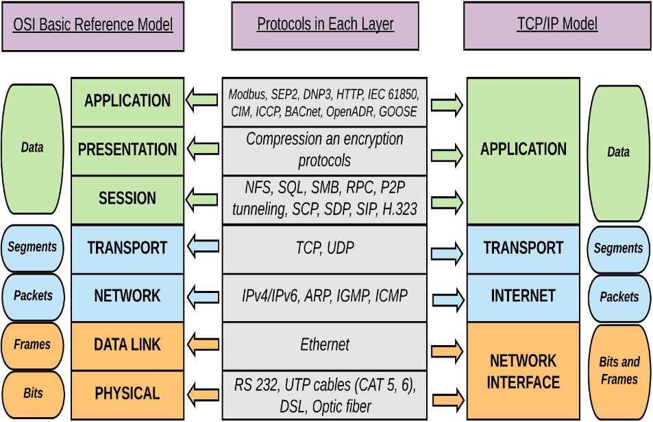

The Open Systems Interconnection Model 
# эталонная модель взаимодействия
Процесс инкапсуляции - передача сигнала с верхнего до нижнего уровня.
Декапсуляция - обратный процесс.

## 7 application
**Прикладной уровень** описывает пользовательские программы/приложения, которые в большинстве случаев взаимодействуют с пользователем. 
## 6 presentation 
**Представительный уровень** - все полученные данные преобразуются в определенные формат, код, форму, которые понятны самому компьютеру и остальным уровням. 
##  5 session
**Сеансовый уровень** - на этом уровне устанавливается и поддерживается диалог с другим компьютером или сервером.
## 4 transport
**Транспортный уровень** - здесь обеспечивается надежное взаимодействие твоего компьютера с другим компьютером. Если по каким-то причинам связь кратковременно оборвется или уменьшится скорость передачи данных, то этот уровень обеспечит нормальное функционирование и восстановление диалога с удаленным узлом. 
## 3 network
**Сетевой уровень** - на этом уровне происходит поиск оптимального маршрута (маршрутизация) к удаленному устройству на основе его сетевого адреса - IP адреса.
## 2 data link
**Канальный уровень** - на этом уровне обеспечивается взаимодействие 2-х разных сетевых устройств друг с другом через преобразование данных язык, понятный противоположному узлу посредством MAC-адреса.
## 1 physical
**Физический уровень** - это уровень представляет собой среду распространения сигнала. В качестве среды передачи может выступать электрический и оптический кабели, радио и спутниковые антенны. 
# источник
1. https://imvk.net/cisco/urok-1-etalonnaya-model-osi