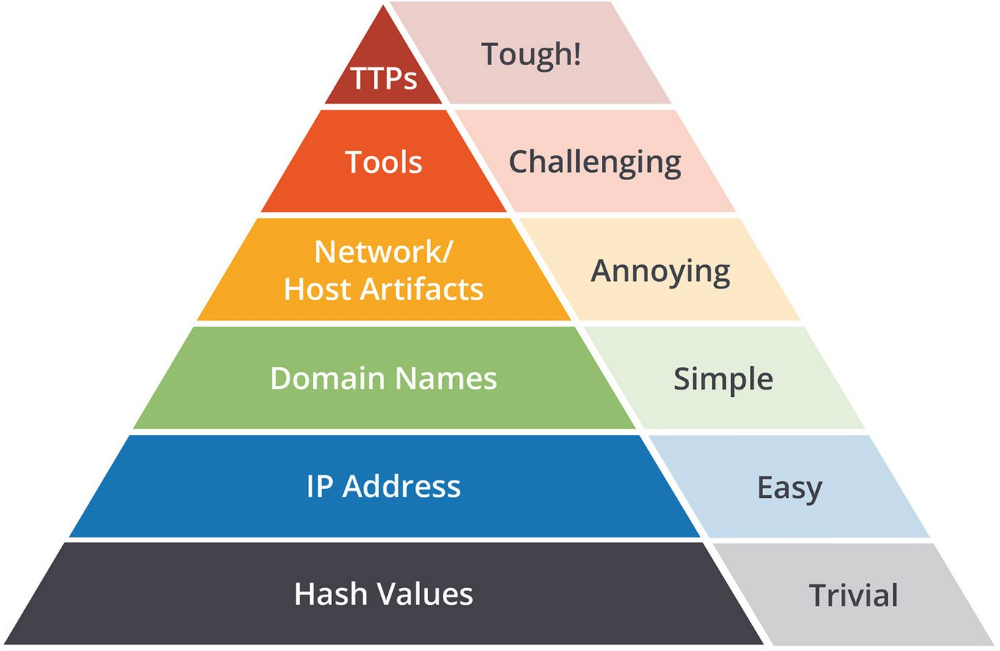

# Значения хэша Hash Values
значением хэша называют числовое значение фиксированной длины, которое однозначно идентифицирует данные. хэш получается в результаты алгоритма. самыми распространёнными являются MD5 (RFC 1321), SHA-1, SHA-2 (RFC 3174). существуют базы данных, в которых собраны хэши вредоносных файлов. в интернете хэш можно проверить через [VirusTotal](https://www.virustotal.com/gui/) или [Metadefender Cloud - OPSWAT](https://metadefender.opswat.com/?lang=en).
# IP-адреса IP Address
Fast Flux - это технология DNS, используемая ботнетами для сокрытия фишинга, веб-прокси, доставки вредоносных программ и передачи вредоносных сообщений за скомпрометированными хостами, действующими в качестве прокси-серверов. Цель использования сети Fast Flux состоит в том, чтобы сделать взаимодействие между вредоносным ПО и его сервером управления (C&C) более сложным для обнаружения специалистами по безопасности. Распространенной тактикой защиты от подобного является блокирование, отбрасывание или отклонение входящих запросов с незнакомых IP-адресов.
Проверить IP-адрес можно [здесь](https://any.run/).
# Доменные имена Domain Names
Злоумышленники могут подменять ссылки на популярные сайты через паникод (Punycode) или сокращение ссылок сторонними сервисами. Обе ссылки могут одинаково выглядеть, но в действительности ссылка злоумышленника скрывает за собой дополнительные символы и ведёт на фишинговый сайт. Проверить доменные имена можно [здесь](https://any.run/).
# Host Artifacts
Артефаками хоста называют следы или наблюдаемые объекты, которые злоумышленники оставляют в системе, такие как значения реестра, подозрительное выполнение процессов, шаблоны атак или индикаторы компрометации IOCs (Indicators of Compromise), файлы, удаленные вредоносными приложениями, или что-либо, относящееся исключительно к текущей угрозе.
# Network Artifacts
Сетевым артефактом может быть строка user-agent, информация C2 или шаблоны URI, за которыми следуют запросы HTTP POST. User-Agent определяется RFC2616 как поле заголовка запроса, которое содержит информацию об агенте пользователя, отправляющем запрос. Сетевые артефакты могут быть обнаружены в Wireshark PCAPs (файле, содержащем пакетные данные сети) с помощью анализатора сетевых протоколов, такого как TShark, или путем изучения протоколирования [IDS](ids-ips.md) из источника, такого как Snort.
# Инструменты Tools
Злоумышленники могут использовать утилиты для создания вредоносных макродокументов (maldocs) для попыток фишинга, бэкдора, который может быть использован для установки C2 (инфраструктуры управления Command and Control Infrastructure), любых пользовательских .EXE и DLL файлов, полезной нагрузки или взлома паролей. В этом случае работают антивирусные сигнатуры, правила обнаружения и правила YARA.
Нечеткое хэширование (Fuzzy hashing) помогает сопоставить два файла с незначительными различиями на основе значений нечеткого хэша. Его ещё могут называть контекстно-зависимые кусочные хэши (сontext triggered piecewise hashes - CTPH). Подобный ресурс представлен [здесь](https://ssdeep-project.github.io/ssdeep/index.html). 
# TTPs
# источник
https://tryhackme.com/r/room/pyramidofpainax