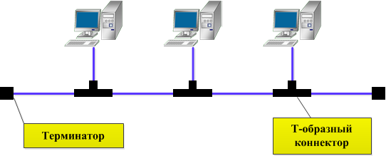
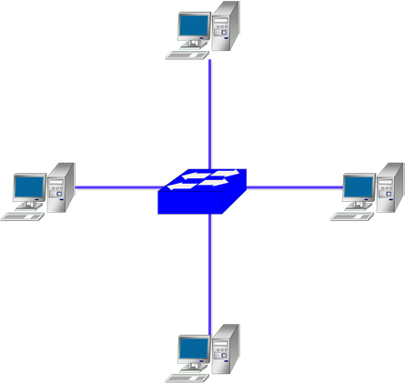
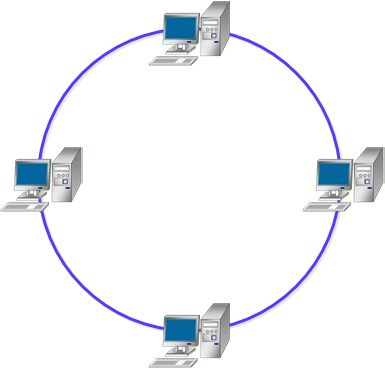
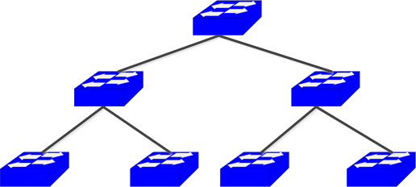
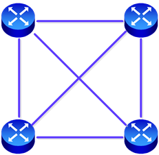

# Шина Bus
Все устройства в сети подключены к единому средству связи (обычно коаксиальному кабелю) - шине. Данные передаются по шине в одном направлении, и устройства ищут свой адрес в данных, чтобы понять, предназначено ли это для них.

**Преимущества:**
- Простота настройки и расширения
- Требуется меньше кабелей, чем для других топологий
**Недостатки:**
- Если выходит из строя основной кабель, выходит из строя вся сеть
- Производительность снижается по мере добавления новых устройств
- Ограниченная длина кабеля и количество устройств

в технологии Ethernet 10Base2 максимальная длина составляла 185 м, в Ethernet 10Base5 - 500 м.

# Звезда Star
соединяет все устройства с центральной точкой или концентратором (обычно коммутатором или маршрутизатором). Центральная точка отвечает за передачу данных между устройствами в сети.

**Преимущества:**
- Легко добавлять или удалять устройства, не затрагивая остальную сеть
- Если одно устройство выходит из строя, это не влияет на всю сеть
- Централизованное управление
**Недостатки:**
- Требуется больше кабелей, чем шинная топология
- Если центральный узел выходит из строя, выходит из строя вся сеть
- Ограниченный радиус действия: расстояние между устройствами определяется длиной кабелей, подключаемых к центральному концентратору или коммутатору. Более длинные отрезки кабеля могут увеличить задержку и снизить производительность сети.
 
# Кольцо Ring
Устройства подключаются по круговой схеме, при этом у каждого устройства есть ровно два соседа. Данные передаются в одном направлении по кольцу, проходя через каждое устройство, прежде чем достичь места назначения.

**Преимущества:**
- Равный доступ к ресурсам для всех устройств
- Может справляться с большими нагрузками на трафик
**Недостатки:**
- Добавление или удаление устройств может привести к нарушению работы сети
- Если одно устройство выходит из строя, это может повлиять на всю сеть
- Передача данных может быть медленной из-за циклической структуры

используется в технологиях Token Ring и FDDI

# Дерево Tree
имеет разветвленную структуру и представляет собой сеть, состоящую из нескольких подсетей, подключенных по схеме Звезда.

**Преимущества:**
- Хорошо масштабируемая сеть (большой потенциал для расширения)
- Легко найти неисправности
**Недостатки:**
- Зависимость нижестоящих узлов от вышестоящих, то есть отказ одного вышестоящего узла может привести к отказу всей ветки
- Требуется много кабеля

# Ячеистая Mesh
соединяет все устройства напрямую с любыми другими устройствами в сети. Это может быть полная сетка (где каждое устройство подключено ко всем другим устройствам) или частичная сетка (где одни устройства подключены ко всем остальным, в то время как другие поддерживают лишь несколько подключений).

**Преимущества:**
- Высокая отказоустойчивость и избыточность, повышающие устойчивость
- Устраняет необходимость в центральном узле
**Недостатки:**
- Требуется большое количество кабелей, что делает его дорогостоящим и сложным в управлении
- Настройка и обслуживание могут быть сложными
# Каждый с каждым Full Mesh
является самой надежной, так как к одному узлу сразу подключены как минимум 2 соседних устройства. В то же время такая схема сети является и самой дорогой.

**Преимущества:**
- Хорошо масштабируемая сеть (большой потенциал для расширения)
- Отказоустойчивая
**Недостатки:**
- Дорогостоящая
- В некоторых случая тяжело реализовать

# Гибридная Hybrid
объединяет две или более различных топологий в единой сети. Ее можно настроить в соответствии с конкретными требованиями к сети и производительности.

**Преимущества:**
- Может быть адаптирована к конкретным потребностям
- Оптимизирует сильные стороны различных топологий
**Недостатки:**
- Может быть сложным процессом, которым трудно управлять
- Дороже, чем другие топологии
# источники
1. https://imvk.net/cisco/urok-9-topologii-kompyuternykh-setej
2. https://roadmap.sh/cyber-security