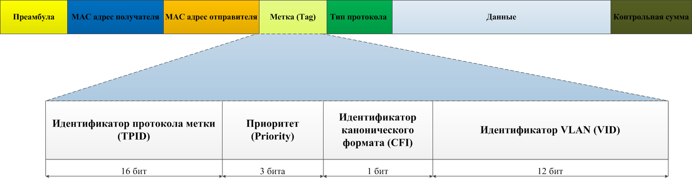

virtual local area network

Коммутаторы поддерживают технологии IEEE 802.1Q. Суть технологии заключается в том, что в [Ethernet](ethernet.md) кадр вставляется специальная 4-х байтовая метка. Метка содержит 12-битный идентификатор VLAN, максимальное значение которого 4096. То есть всего может быть 4096 VLAN:

Типы VLAN:
- VLAN на основе портов: устройства разделяются на основе их физического подключения к коммутатору. Каждый порт назначен определенной VLAN.
- Сети VLAN на основе протоколов: Устройства группируются в зависимости от используемого ими сетевого протокола. Например, все IP-устройства могут быть назначены одной VLAN, в то время как устройства IPX могут быть назначены другой.
- Сети VLAN на базе MAC: Устройства назначаются сетям VLAN на основе их MAC-адресов. Такой подход обеспечивает лучшую безопасность и гибкость, но требует больше административных усилий.
В качестве соображений безопасности рекомендуют применять частные VLAN и [списки контроля доступа](acl.md) (Access Control Lists - ACL).

Порт доступа (access port) имеет нетегированные (untagged) кадры, а магистральный порт (trunk port) - тегированные (tagged) кадры.
## TRUNK MODE - DTP

Для автоматической настройки магистрального порта коммутаторы поддерживают специальный протокол DTP (Dynamic Trunk Protocol), который периодически посылает кадры соседним портам. Все коммутаторы поддерживают 4 режима работы магистрального порта: 
- Auto - DTP-кадры не рассылает. Приняв DTP-кадр сразу переходит в магистральный режим. 
- Desirable - рассылает DTP-кадры. Если на другом конце готовы перейти в магистральный режим, то сразу оба порта переходят в данный режим. 
- Trunk - статический магистральный режим. DTP-кадры не рассылает. 
- Nonegotiate - готов перейти в магистральный режим только, если на другом конце установлен магистральный режим. DTP-кадры не рассылает.
## NATIVE VLAN

Eсли нам понадобится управлять коммутаторами, в стандарте 802.1Q предусматривается так называемый Native VLAN. Все кадры в Native VLAN нетегированные. По умолчанию VLAN 1 является нативный и используется в качестве выделенного канала управления.
## VTP / GVRP

Когда в сети установлено большое количество коммутаторов, то настройка всех VLAN на каждом коммутаторе задача довольно утомительная. Для этой цели Cisco разработала магистральный (транкинговый) протокол виртуальных сетей VTP (VLAN  Trunking Protocol). Существует аналогичный протокол в IEEE - GVRP.

4 режима:
- Сервер Server;
- Клиент Client;
- Прозрачный Transparent;
- Выключен Off.

Сервер рассылает анонсы, а клиенты обновляют свою базу данных на основе принятых анонсов.
## Протокол CDP
Cisco Discovery Protocol

проприетарный протокол Cisco, служит для определения соседних подключенных устройств, работает на канальном уровне. можно получить следующую информацию о соседнем устройстве:
- Тип платформы устройства;
- Версию IOS;
- Тип и номер удаленного порта, а также его IP адрес;
- Тип и номер локального порта, а также его IP адрес.
Существует открытый подобный протокол  LLDP.
# источники
1. https://imvk.net/cisco/urok-17-virtualnye-lokalnye-seti-vlan
2. https://imvk.net/cisco/urok-18-protokol-vtp
3. https://imvk.net/cisco/urok-22-protokol-cdp
4. https://roadmap.sh/cyber-security