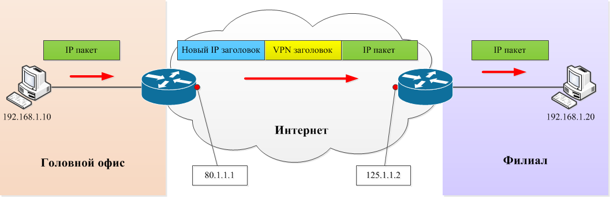

virtual private network
виртуальная частная сеть

представляет собой надежный зашифрованный канал, другими словами, туннель. участники такой связи физически подключены к интернету и относятся к разным подсетям, но логически в одном виртуальном канале. 
- компонентами
	являются впн-клиент, впн-сервер и способ шифрования. простыми словами, при подключении к интернету ip адрес клиента заменяется на ip адрес сервера. отправитель шифрует исходный пакет через согласованный алгоритм, добавляет заголовок, после пакет инкапсулируется в новый ip пакет с новым ip адресом. получатель декапсулирует пакет, убирает впн заголовки и дешифрует пакет.
	
- принципы
	аутентификация клиентов, шифрование, контроль целостности данных, периодическая смена ключей
- типы
	1. intranet (филиалы используют ресурсы головного офиса и взаимодействуют с ним)
	2. extranet (партнеры в лице поставщиков, потребителей используют общедоступные ресурсы компании)
	у первых двух типов туннель устанавливается между пограничными маршрутизаторами сетей.
	3. коммутируемые (удаленное подключение через личные устройства сотрудников). туннель устанавливается от самого устройства до пограничного маршрутизатора.
- примеры протоколов для создания vpn
	- GRE  - Generic Routing Encapsulation
	- IPsec - IP Security
	- Easy Cisco VPN 
	- Web VPN
	- L2/L3 VPN
# источники
1. https://imvk.net/cisco/urok-44-virtualnye-chastnye-seti-vpn
2. https://roadmap.sh/cyber-security